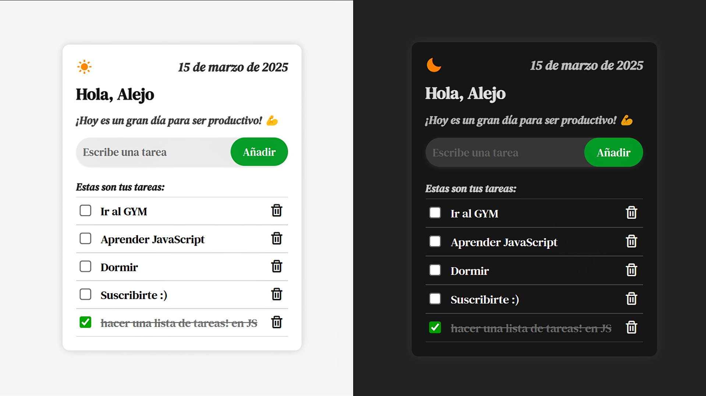

# Lista de Tareas con Modo Oscuro 🌙☀️
## Vista Previa

¡Así es como luce la Lista de Tareas!

**Por: [DevBy Lualmara](https://github.com/Lualmara-5)**

---

## Descripción

Este proyecto es una Lista de Tareas Interactiva que permite a los usuarios:

- ✅ Añadir nuevas tareas
- ✅ Eliminar tareas
- ✅ Marcar tareas como completadas
- ✅ Alternar entre modo claro y oscuro

Desarrollado con **HTML**, **CSS** y **JavaScript**, esta aplicación ofrece una interfaz simple e intuitiva con una experiencia visual atractiva. El modo oscuro ayuda a reducir la fatiga visual y brinda una apariencia moderna y elegante. 🌑✨

El tutorial paso a paso para crear esta ista de Tareas estará disponible en el canal de YouTube **[DevBy Lualmara](https://www.youtube.com/@DevByLualmara)**.

---

## ¡Dame tu Apoyo!

Si te ha gustado este proyecto, no dudes en darme una ⭐ en el repositorio. ¡Eso me motiva a seguir creando contenido y mejorando mis proyectos!

¡Gracias por tu apoyo! 😊

---
